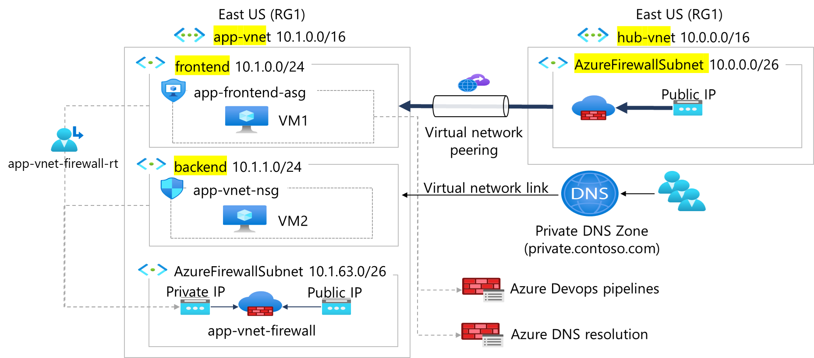

---
lab:
  title: 'Ejercicio: Aislamiento y segmentación de red para la aplicación web'
  module: Guided Project - Configure secure access to workloads with Azure virtual networking services
---

# Laboratorio: Aislamiento y segmentación de red para la aplicación web

## Escenario

El departamento de TI necesita aislamiento y segmentación de redes para la aplicación web. Para proporcionar aislamiento y segmentación de red para la aplicación web, debe crear una red virtual de Azure con subredes proporcionadas por el equipo de TI. Una vez creada la red virtual, el siguiente paso es configurar el emparejamiento de red virtual. Esto permite que las redes virtuales se comuniquen entre sí de forma segura y privada.

### Diagrama de la arquitectura

### Tareas de aptitudes
- Creación de una red virtual
- Creación de una subred
- Configuración del emparejamiento de red virtual

## Instrucciones del ejercicio

>**Nota**: Para completar este laboratorio, necesitará una [suscripción de Azure](https://azure.microsoft.com/free/) con el rol RBAC **Colaborador** asignado.
> En este laboratorio, cuando se le pida que cree un recurso, para las propiedades que no se especifican, use el valor predeterminado.

### Crear redes virtuales y subredes

Comience creando las redes que se muestran en el diagrama anterior. 

1. Abra un explorador y navegue hasta <a href="https://portal.azure.com/#home">Azure Portal</a> e inicie sesión.
1. Para crear una red virtual, en la barra de búsqueda de la parte superior del portal, escriba **Redes virtuales** y seleccione **Redes virtuales** en los resultados.
1. En el panel del portal **Redes virtuales,** seleccione **+ Crear**.
1. Rellene todas las pestañas del proceso de creación mediante los valores de la tabla siguiente:

    | Propiedad | Valor    |
    |:---------|:---------|
    |Grupo de recursos|**RG1**|
    |Nombre|  **app-vnet**|
    |Region| **Este de EE. UU.**|
    |Espacio de direcciones IPv4|    **10.1.0.0/16**|
    |Nombre de subred|   **Front-end**|
    |Intervalo de direcciones de subred|  **10.1.0.0/24**|
    |Nombre de subred|   **backend**|
    |Intervalo de direcciones de subred|  **10.1.1.0/24**|

    **Nota**: Deje los demás valores de configuración en sus valores predeterminados. Seleccione **Siguiente** para avanzar a la pestaña siguiente y **Crear** para crear la red virtual.
1. Siguiendo los mismos pasos que antes, cree la red virtual de Azure **shared-services-vnet** mediante los valores de la tabla siguiente:

    | Propiedad | Valor    |
    |:---------|:---------|
    |Grupo de recursos|**RG1**|
    |Nombre|  **shared-services-vnet**|
    |Region| **Este de EE. UU.**|
    |Espacio de direcciones IPv4|    **10.0.0.0/16**|
    |Nombre de subred|   **Front-end**|
    |Intervalo de direcciones de subred|  **10.0.0.0/24**| 

1. Una vez finalizada la implementación. Vuelva al portal y, en la barra de búsqueda, escriba **grupos de recursos** y seleccione **Grupos de recursos** en los resultados. Seleccione **RG1** en el panel principal y confirme que ambas redes virtuales se han implementado.

### Configuración de una relación del mismo nivel entre las redes virtuales

1. Configurar una relación entre pares entre dos redes virtuales permitirá que el tráfico fluya en ambas direcciones entre las redes virtuales **app-vnet** y **shared-services-vnet**.
1. En el portal, en la vista del grupo de recursos RG1. Seleccione la red virtual **app-vnet**.
1. En el menú contextual **app-vnet** del lado izquierdo del portal, desplácese hacia abajo y seleccione **emparejamientos**.
1. En el panel emparejamientos de **app-vnet**, seleccione **+ Agregar**.
1. Rellene el formulario con los valores de la siguiente tabla: 

    | Propiedad | Valor    | 
    |:---------|:---------|
    |Esta red virtual Nombre del vínculo de emparejamiento|**app-vnet-to-sharedservices**|
    |Red virtual remota Nombre del vínculo de emparejamiento | **sharedservices-to-app-vnet**|
    |Red virtual| **shared-services-vnet**|

    **Nota**: Deje los demás valores de configuración en sus valores predeterminados. Seleccione **Agregar** para crear el emparejamiento de grupo de red virtual.

    [Más información sobre el emparejamiento de red virtual](https://learn.microsoft.com/azure/virtual-network/virtual-network-manage-peering?tabs=peering-portal).

1. Una vez completado el proceso, y después de que se actualice la configuración. Compruebe que el **estado del emparejamiento** está establecido **en Conectado.** (es posible que deba actualizar la página para habilitar la opción Estado de actualización)

